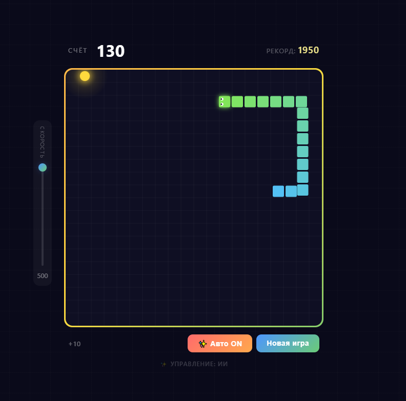

# 🐍 Змейка

Браузерная змейка на чистом JavaScript (canvas, без зависимостей и сборки) с автопилотом (алгоритм BFS + lookahead, не нейросеть), скинами, тремя режимами игры и монетизацией под платформу **Яндекс Игры**.



---

## Запуск локально

Нужен любой статический сервер (открытие `index.html` двойным кликом тоже работает, но сервер надёжнее):

```bash
python -m http.server 8000
```

Затем открыть <http://localhost:8000>.

Вне Яндекс Игр SDK недоступен — игра автоматически переходит в **локальный режим**: реклама заменяется модалкой-симуляцией (~2 сек), сохранения идут в `localStorage`. В консоли браузера будет строка `YSDK недоступен — локальный режим разработки` — это нормально.

## Структура проекта

```
snake/
├── index.html        — разметка: игра, оверлей Game Over, магазин, симуляция рекламы
├── css/style.css     — все стили
├── js/platform.js    — обёртка над Yandex Games SDK (реклама, сохранения, лидерборд)
├── js/game.js        — вся логика игры: движение, ИИ, режимы, скины, звук, отрисовка
├── assets/           — иконка 512×512 и обложка 800×470 для карточки Яндекс Игр
├── image.png         — скриншот для README
└── README.md
```

Принцип: `game.js` ничего не знает о платформе и общается только с объектом `Platform` из `platform.js`. Чтобы портировать игру на другую площадку (Telegram, CrazyGames), достаточно написать вторую реализацию `Platform` с теми же методами.

## Геймплей

| Возможность | Описание |
|---|---|
| **Режимы** | Классика (стены убивают) · Без стен (проход сквозь края) · Препятствия (14 блоков; генерация с проверкой связности поля, зона старта всегда свободна) |
| **Управление** | Стрелки / WASD (работает на любой раскладке через `e.code`), свайпы на мобильных, `P`/`Esc` — пауза |
| **ИИ-автопилот** | Кнопка «✨ Авто»: BFS до еды + погоня за хвостом + lookahead на 8 ходов; понимает все режимы |
| **Еда** | 🍎 обычная +10 очков, ⭐ бонусная +30 (появляется на каждых кратных 50 очках) |
| **Скорость** | Слайдер 3–500 мс/ход; автоускорение каждые 50 очков |
| **Звук** | WebAudio-синтез (без файлов): еда, бонус, смерть, покупка, возрождение; кнопка 🔊/🔇 |

## Экономика и монетизация

Дизайн строится вокруг трёх точек показа рекламы — все проходят через `js/platform.js`:

1. **Rewarded «Возродиться»** (экран Game Over) — счёт и монеты сохраняются, змейка стартует заново. Один раз за раунд. Самая доходная точка: игрок мотивирован сохранить прогресс.
2. **Rewarded «Удвоить очки»** (экран Game Over) — x2 к финальному счёту перед отправкой в лидерборд. Один раз за раунд.
3. **Interstitial** между раундами — при нажатии «Новая игра». Кулдаун 65 секунд, первый раунд никогда не прерывается (требование модерации Яндекс Игр).

Дополнительно: скин «Призрак» выдаётся за просмотр rewarded — четвёртая точка показа.

**Мягкая валюта (монеты 🪙):** +1 за еду, +5 за бонус, +100 за победу (заполненное поле). Тратятся в магазине скинов:

| Скин | Цена |
|---|---|
| Классика | бесплатно |
| Неон | 150 🪙 |
| Огонь | 300 🪙 |
| Призрак | 📺 за рекламу |
| Золото | 600 🪙 |
| Радуга (анимированная) | 1000 🪙 |

**Сохранения:** объект `save` (монеты, рекорд, купленные скины, выбранный скин, режим, звук) пишется в облако игрока Яндекса (`player.setData`) и дублируется в `localStorage`. При запуске рекорд из старой версии игры мигрирует автоматически.

**Лидерборд:** лучший счёт отправляется в лидерборд с техническим именем `snakeScore` (нужно создать в консоли разработчика, см. ниже).

## Интеграция Yandex Games SDK

Всё в [js/platform.js](js/platform.js):

- SDK подгружается с `https://yandex.ru/games/sdk/v2` с таймаутом 5 сек; при неудаче — локальный режим (актуальный URL сверяйте с [документацией](https://yandex.ru/dev/games/)).
- `LoadingAPI.ready()` вызывается после загрузки сохранений — **обязательное требование модерации**.
- `GameplayAPI.start()/stop()` вызываются на старте раунда, паузе, открытии магазина и Game Over.
- Реклама: `adv.showRewardedVideo` (награда только после `onRewarded`) и `adv.showFullscreenAdv`.
- Игрок запрашивается с `scopes: false` — без запроса персональных данных, работает и для анонимов.

## Публикация на Яндекс Играх — пошагово

1. **Аккаунт разработчика.** Зайти в [Консоль разработчика Яндекс Игр](https://games.yandex.ru/console/) под Яндекс-аккаунтом, принять условия.
2. **Создать черновик игры** («Создать игру»), указать название «Змейка» (или своё уникальное — проверьте поиском по каталогу, змеек много; варианты: «Неоновая змейка», «Змейка: ИИ-автопилот»).
3. **Собрать архив.** ZIP всего содержимого проекта, `index.html` — в корне архива. `README.md` и `image.png` можно не включать, но они не мешают.
4. **Загрузить архив** во вкладке «Файлы игры», отметить использование SDK v2.
5. **Создать лидерборд**: вкладка «Лидерборды» → имя `snakeScore`, тип «числовой», порядок «больше — лучше». Имя должно совпадать с `LEADERBOARD_NAME` в `platform.js`.
6. **Заполнить карточку**: описание (RU), категория «Аркады», возрастной рейтинг 0+, обложка и скриншоты (сделать в разных режимах/скинах; требования к размерам показывает сама консоль).
7. **Проверить в песочнице.** Консоль даёт ссылку на черновик — там игра работает уже с настоящим SDK: проверить рекламу, лидерборд, сохранения, мобильную версию (свайпы).
8. **Отправить на модерацию.** Типичные причины отказа, которые у нас уже закрыты: нет `LoadingAPI.ready()`, реклама мимо SDK, игра не адаптивна, внешние ссылки, реклама в первые секунды. Отдельно проверьте, что в архиве нет ссылок на сторонние сайты.
9. **Монетизация.** После публикации в консоли подключить показ рекламы (РСЯ подключается через саму платформу; выплаты — по условиям партнёрской программы Яндекс Игр). Доход виден в разделе статистики.

## Чеклист перед подачей

- [ ] Игра работает в песочнице консоли: реклама, лидерборд, сохранения
- [ ] Лидерборд `snakeScore` создан
- [ ] Мобильная версия: свайпы, вёрстка на узком экране
- [x] Иконка 512×512 и обложка 800×470 — готовы в `assets/`
- [ ] Уникальное название и описание, 2–3 скриншота геймплея
- [ ] В архиве нет внешних ссылок и лишних файлов
- [ ] `image.png` актуален (скриншот новой версии с магазином/режимами)

## Дорожная карта

- **Этап 1 — Яндекс Игры** *(текущий)*: режимы, монеты, скины, звук, пауза, rewarded/interstitial, лидерборд, публикация.
- **Этап 2 — Telegram Mini App**: вторая реализация `Platform` (реклама Adsgram, облачное хранилище Telegram, шаринг результата в чат). Переиспользуется ~90% кода.
- **Этап 3 — CrazyGames / Poki**: английская локализация (вынести строки в словарь), их SDK, подача с упором на фишку ИИ-автопилота.
- **Идеи в очередь**: ежедневный челлендж (фиксированный seed), экранный джойстик для мобильных, музыка, таймер на бонусную еду, достижения.

## Changelog

- **v2.0** — режимы игры (классика / без стен / препятствия), монеты и магазин скинов (6 скинов), звук на WebAudio, пауза, DOM-экран Game Over с «Возродиться 📺» и «x2 очков 📺», интеграция Yandex Games SDK с локальным фолбэком, облачные сохранения, лидерборд, interstitial между раундами. Код разбит на `platform.js` / `game.js` / `style.css`.
- **v1.x** — одиночный `index.html`: змейка с ИИ-автопилотом, слайдер скорости, свайпы, бонусная еда, рекорд в `localStorage`, фикс WASD на не-US раскладках.
